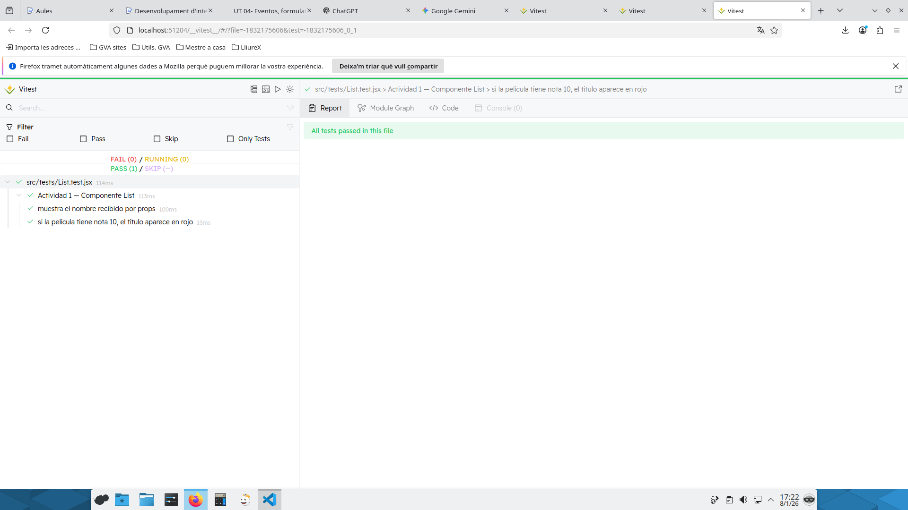
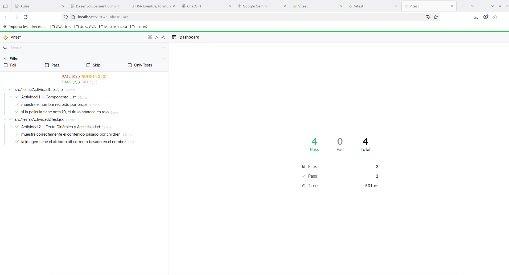

# Informe de Testing - Silvia Cachón Leiva
## Actividad 1
* **Reto:** Comprueba que el componente List muestra correctamente el nombre pasado por props y que, si la película tiene una nota de 10, el título aparece en color rojo (clase text-red-600).

* **Prompt IA:** Le he pasado los criterios de evalucion y luego el enunciado de la actividad y el componente List.jsx.

* **Explicación del Test:** 

Este test sigue el patrón **AAA (Arrange, Act, Assert)**, que ayuda a organizar las pruebas de manera clara.

**Arrange (Preparar)**  
Primero se renderiza el componente `List` usando `render()` y se le pasan las props necesarias para comprobarlo.

**Act (Actuar)**  
Para buscar los elementos usamos selectores como `getByRole`.

- **`getByRole("article")`**: Encuentra el `<article>` que envuelve el componente, usando su `aria-label`.

**Assert (Afirmar)**  
Por último, con `expect()` comprobamos que el resultado es el correcto.  
Por ejemplo, que el nombre se muestre en pantalla o que el título tenga la clase `text-red-600` cuando la película tiene nota 10.

## Actividad 2
* **Reto:** Verifica que el componente List renderiza correctamente el contenido que se le pasa a través de children (por ejemplo la clasificación o biografía) y comprueba que la imagen tiene el atributo alt correcto basado en el nombre del intérprete o de la película.

* **Prompt IA:** Le pasé el enunciado de la actividad y el componente.

* **Explicación del Test:** 

Este test sigue el patrón **AAA (Arrange, Act, Assert)**, que sirve para organizar bien los tests y que sean fáciles de leer.

**Arrange (Preparar)**  
Primero se renderiza el componente `List` usando `render()` y se le pasan las props necesarias.

**Act (Actuar)**  
Para buscar los elementos usamos selectores como:

- **`getByRole("article")`**: Encuentra el `<article>` que envuelve el componente, usando su `aria-label`.
- **`within(article).getByText("…", { selector: "p" })`**: Busca el texto **solo dentro del `
`**, evitando elementos ocultos como `<figcaption>`.
- **`getByAltText`**: Busca la imagen usando su atributo `alt`.

**Assert (Afirmar)**  
Por último, con `expect()` comprobamos que el resultado es correcto:

- Que el texto de `children` aparezca dentro del `
` del componente.
- Que la imagen tenga el `alt` correcto basado en el nombre del intérprete.

