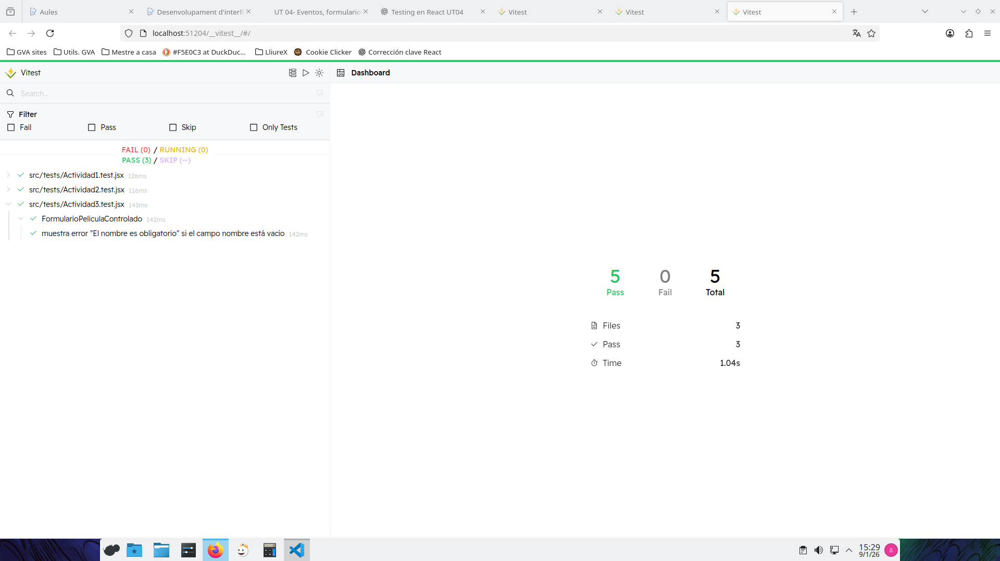
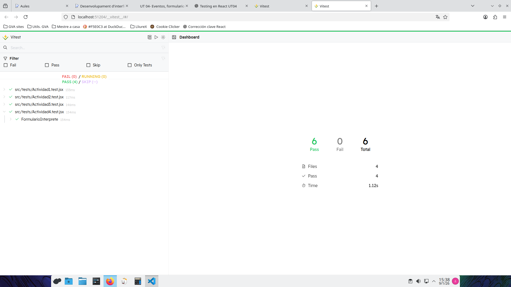
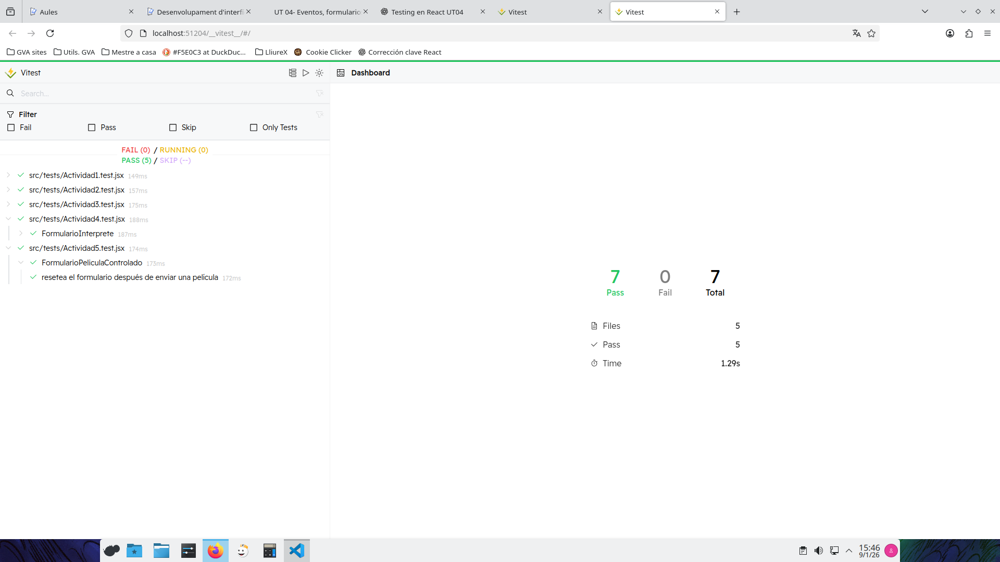
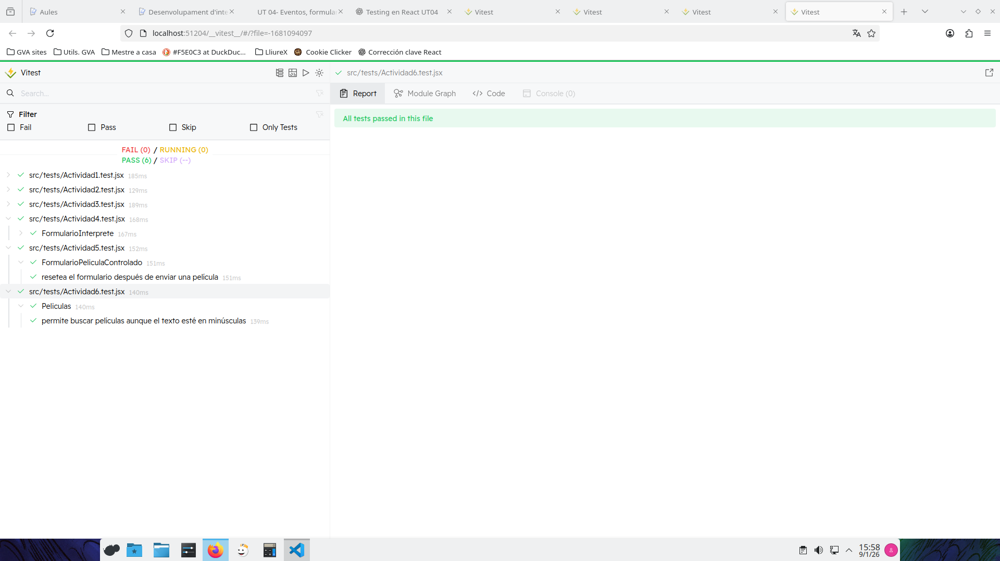
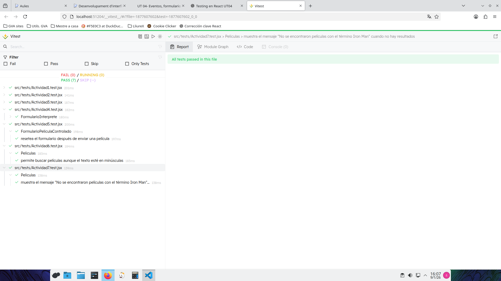
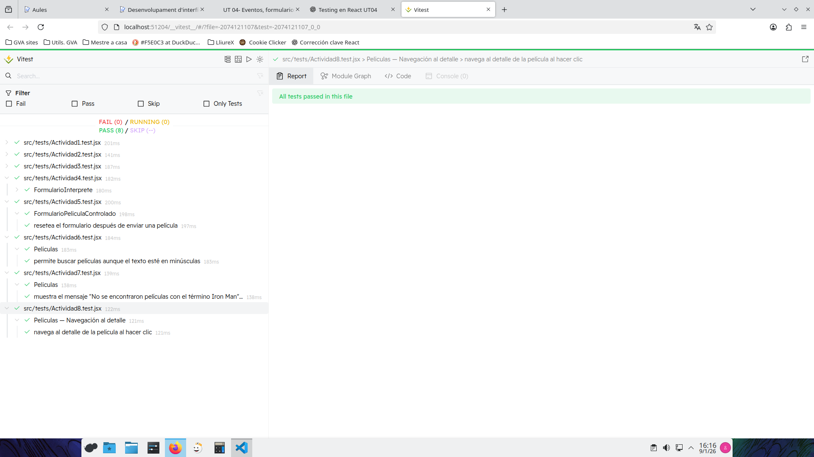
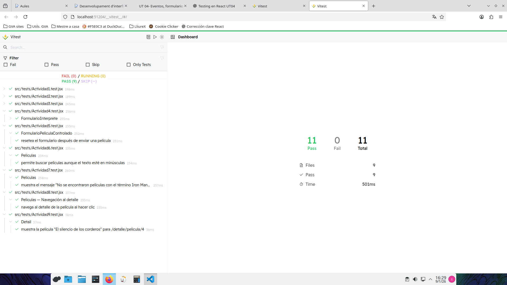
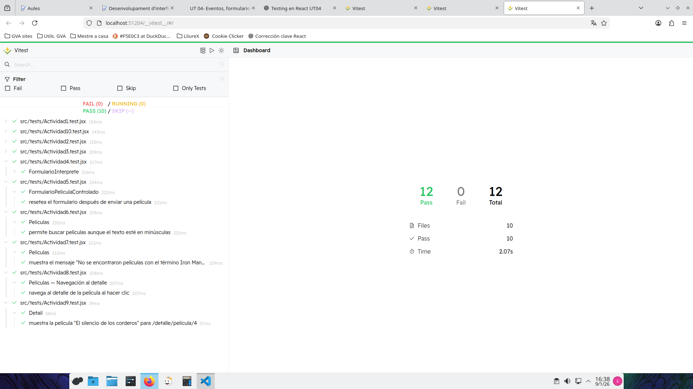

# Informe de Testing - Silvia Cachón Leiva
## Actividad 1
* **Reto:** Comprueba que el componente List muestra correctamente el nombre pasado por props y que, si la película tiene una nota de 10, el título aparece en color rojo (clase text-red-600).

* **Prompt IA:** Le he pasado los criterios de evalucion y luego el enunciado de la actividad y el componente List.jsx.

* **Explicación del Test:** 

Este test sigue el patrón **AAA (Arrange, Act, Assert)**, que ayuda a organizar las pruebas de manera clara.

**Arrange (Preparar)**  
- Primero se renderiza el componente `List` usando `render()` y se le pasan las props necesarias para comprobarlo.

**Act (Actuar)**  
Para buscar los elementos usamos selectores como `getByRole`.

- `getByRole("article")`: Encuentra el `<article>` que envuelve el componente, usando su `aria-label`.

**Assert (Afirmar)**  
- Por último, con `expect()` comprobamos que el resultado es el correcto.  
    - Por ejemplo, que el nombre se muestre en pantalla o que el título tenga la clase `text-red-600` cuando la película tiene nota 10.

## Actividad 2
* **Reto:** Verifica que el componente List renderiza correctamente el contenido que se le pasa a través de children (por ejemplo la clasificación o biografía) y comprueba que la imagen tiene el atributo alt correcto basado en el nombre del intérprete o de la película.

* **Prompt IA:** Le pasé el enunciado de la actividad y el componente.

* **Explicación del Test:** 

Este test sigue el patrón **AAA (Arrange, Act, Assert)**, que sirve para organizar bien los tests y que sean fáciles de leer.

**Arrange (Preparar)**  
- Primero se renderiza el componente `List` usando `render()` y se le pasan las props necesarias.

**Act (Actuar)**  
Para buscar los elementos usamos selectores como:

- `getByRole("article")`: Encuentra el `<article>` que envuelve el componente, usando su `aria-label`.
- `within(article).getByText("…", { selector: "p" })`: Busca el texto*solo dentro del `
`, evitando elementos ocultos como `<figcaption>`.
- `getByAltText`: Busca la imagen usando su atributo `alt`.

**Assert (Afirmar)**  
Por último, con `expect()` comprobamos que el resultado es correcto:

- Que el texto de `children` aparezca dentro del `
` del componente.
- Que la imagen tenga el `alt` correcto basado en el nombre del intérprete.

## Actividad 3
* **Reto:** En FormularioPeliculaControlado.jsx, verifica que, si el usuario intenta enviar el formulario con el nombre vacío, aparece el mensaje "El nombre es obligatorio".

* **Prompt IA:** Le pasé el enunciado de la actividad y el componente.

* **Explicación del Test:** 

Este test sigue el patrón **AAA (Arrange, Act, Assert)**, que sirve para organizar bien los tests y que sean fáciles de leer.

**Arrange (Preparar)**  
- Se renderiza el componente FormularioPeliculaControlado usando `render()`.

- No se rellenan campos para simular que el usuario envía el formulario vacío.

**Act (Actuar)**  

- Se busca el botón de envío con `getByRole("button", { name: /Añadir Película/i })`.
- Se simula un click sobre el botón de submit usando `fireEvent.click(submitButton)`.
- En este test se utiliza `userEvent.click` porque se quiere simular el envío del formulario de forma similar a como lo haría un usuario real, pulsando el botón de submit sin rellenar ningún campo.

**Assert (Afirmar)**  
- Se comprueba que el mensaje de error "El nombre es obligatorio." aparece en el DOM con `expect(screen.getByText("El nombre es obligatorio.")).toBeInTheDocument()`.

## Actividad 4
* **Reto:** En FormularioInterprete.jsx, valida que, si la biografía tiene menos de 50 caracteres, aparece el error: "La biografía debe tener al menos 50 caracteres".

* **Prompt IA:** Le pasé el enunciado de la actividad y el componente.

* **Explicación del Test:** 

Este test sigue el patrón **AAA (Arrange, Act, Assert)**, que sirve para organizar bien los tests y que sean fáciles de leer.

**Arrange (Preparar)**  
- Se renderiza el componente `FormularioInterprete` usando `render()`.  

- Se identifican los campos del formulario mediante selectores accesibles (`getByLabelText`, `getByRole`) para simular la interacción del usuario.

**Act (Actuar)**  

- Se rellenan los campos obligatorios con valores válidos, excepto la biografía, que se deja con un texto demasiado corto (`"Biografía corta"`).  

- Se dispara el evento `click` sobre el botón de envío (`Añadir Intérprete`) usando `fireEvent.click()`.

- En este test se utiliza `fireEvent` porque no es relevante el proceso de interacción del usuario, sino únicamente comprobar que, al recibir determinados valores en los inputs, el componente muestra el mensaje de error correspondiente.

- El objetivo del test es validar la lógica de validación del formulario, no el comportamiento detallado de la escritura del usuario.

**Assert (Afirmar)**  
- Se comprueba que el mensaje de error se muestra en pantalla.  

## Actividad 5
* **Reto:** Verifica que al rellenar el título en el formulario controlado FormularioPeliculaControlado.jsx y pulsar enviar, el campo vuelve a estar vacío (reset).

* **Prompt IA:** Le pasé el enunciado de la actividad y el componente.

* **Explicación del Test:** 

Este test sigue el patrón **AAA (Arrange, Act, Assert)**, que sirve para organizar bien los tests y que sean fáciles de leer.

**Arrange (Preparar)**  
- Se renderiza el componente FormularioPeliculaControlado usando `render()`.
- Se obtiene el input del nombre y el botón de envío usando `screen.getByLabelText` y `screen.getByRole`.

**Act (Actuar)**  

- Se simula que el usuario escribe un título de película en el input `(userEvent.type(nombreInput, "Inception"))`. 

- Se simula el envío del formulario con `userEvent.click(botonSubmit)`.

- En este test se utiliza `userEvent` porque se quiere simular el flujo completo del usuario: escribir en el input y enviar el formulario, comprobando después que el formulario se resetea correctamente.

**Assert (Afirmar)**  
- Se comprueba que, después del envío, el campo del nombre esté vacío `(expect(nombreInput.value).toBe(""))`, confirmando que el formulario se ha reseteado correctamente. 

## Actividad 6
* **Reto:** Comprueba que el buscador en Peliculas.jsx funciona, aunque el usuario escriba en minúsculas (ej: "sexto" para encontrar "El sexto sentido"). 

* **Prompt IA:** Le pasé el enunciado de la actividad y el componente.

* **Explicación del Test:** 

Este test sigue el patrón **AAA (Arrange, Act, Assert)**, que sirve para organizar bien los tests y que sean fáciles de leer.

**Arrange (Preparar)**  
- Se renderiza el componente Peliculas dentro de un `MemoryRouter`, ya que el componente utiliza `Link` de `react-router-dom` y necesita un contexto de enrutado para funcionar correctamente en el entorno de testing.

- Además, se localiza el campo de búsqueda utilizando el placeholder `"Buscar películas por nombre..."`.

**Act (Actuar)**  

- Se simula la escritura del usuario en el campo de búsqueda usando `userEvent.type`, introduciendo el texto "sexto" en minúsculas.. 

- Esto imita el comportamiento real de un usuario escribiendo en el buscador.

**Assert (Afirmar)**  
- Por último, se comprueba que la película "El sexto sentido" aparece en el documento, lo que confirma que el filtrado no distingue entre mayúsculas y minúsculas y funciona correctamente.

## Actividad 7
* **Reto:** Verifica que si buscas una película que no existe (ej: "Iron Man"), aparece el mensaje: "No se encontraron películas con el término Iron Man". 

* **Prompt IA:** Le pasé el enunciado de la actividad y el componente.

* **Explicación del Test:** 

Este test sigue el patrón **AAA (Arrange, Act, Assert)**, que sirve para organizar bien los tests y que sean fáciles de leer.

**Arrange (Preparar)**  
- Se renderiza el componente Peliculas dentro de un `MemoryRouter`, ya que el componente utiliza `Link` de `react-router-dom` y necesita un contexto de enrutado para funcionar correctamente en el entorno de testing.

- Además, se localiza el campo de búsqueda utilizando el placeholder `"Buscar películas por nombre..."`.

**Act (Actuar)**  

- Se simula la escritura del usuario en el campo de búsqueda mediante `userEvent.type`, introduciendo el texto "Iron Man".

- Esto imita el comportamiento real de un usuario escribiendo en el buscador.

**Assert (Afirmar)**  
- Finalmente, se comprueba que aparece en pantalla el mensaje:  “No se encontraron películas con el término Iron Man.”

## Actividad 8
* **Reto:** Simula un clic en una película del listado y verifica que la URL cambia o que se intenta cargar el componente de detalle.

* **Prompt IA:** Le pasé el enunciado de la actividad y el componente.

* **Explicación del Test:** 

Este test sigue el patrón **AAA (Arrange, Act, Assert)**, que sirve para organizar bien los tests y que sean fáciles de leer.

**Arrange (Preparar)**  
- Se renderiza el componente Peliculas dentro de un `MemoryRouter`, ya que el componente utiliza `Link` de `react-router-dom` y necesita un contexto de enrutado para funcionar correctamente en el entorno de testing.

- Se localiza la película sobre la que queremos hacer clic, por ejemplo "El sexto sentido".

**Act (Actuar)**  

- Se simula un clic en la película usando `userEvent.click()`.

- Se elige `userEvent` en lugar de `fireEvent` porque queremos simular el comportamiento real del usuario al interactuar con el listado y navegar.

**Assert (Afirmar)**  
- Se comprueba que la navegación se intentó.

- En un entorno de test se puede comprobar que el Link apunta a la URL correcta: /detalle/pelicula/ID.

## Actividad 9
* **Reto:** Testea que, si entramos en /detalle/pelicula/4, el componente Detail muestra correctamente la película "El silencio de los corderos”.

* **Prompt IA:** Le pasé el enunciado de la actividad y el componente.

* **Explicación del Test:** 

Este test sigue el patrón **AAA (Arrange, Act, Assert)**, que sirve para organizar bien los tests y que sean fáciles de leer.

**Arrange (Preparar)**  
- Renderizamos el componente `Detail` dentro de un `MemoryRouter`, porque Detail.jsx utiliza `useParams` y `useNavigate` de react-router-dom.

- Configuramos `initialEntries={["/detalle/pelicula/4"]}` para simular que el usuario ha navegado a la ruta /detalle/pelicula/4.

- Añadimos un `<Route>` con path `/detalle/pelicula/:idPeli` para que Detail pueda recibir el parámetro idPeli correctamente.

**Act (Actuar)**  

- Obtenemos el objeto de la película desde los datos importados (peliculas) para saber cuál es el nombre exacto que debería mostrarse.

- No realizamos interacciones de usuario aquí, solo queremos comprobar que el componente renderiza correctamente al recibir el parámetro de ruta.

**Assert (Afirmar)**  
- Verificamos que el nombre de la película aparece en el documento.

## Actividad 10
* **Reto:** En FormularioPeliculaNoControlado.jsx, comprueba que los datos no se validan al escribir, sino solo cuando se hace clic en el botón de enviar.

* **Prompt IA:** Le pasé el enunciado de la actividad y el componente.

* **Explicación del Test:** 

Este test sigue el patrón **AAA (Arrange, Act, Assert)**, que sirve para organizar bien los tests y que sean fáciles de leer.

**Arrange (Preparar)**  
- Se renderiza el componente FormularioPeliculaNoControlado usando `render()`.

- Se obtienen los elementos necesarios del formulario: el input de nombre y el botón de enviar.

**Act 1 (Actuar)**  

- Se simula que el usuario escribe un valor inválido (vacío) en el input usando `fireEvent.change()`.

**Assert 1 (Afirmar)**  

- Se comprueba que no aparece ningún mensaje de error mientras se escribe `(queryByText)`.

**Act 2 (Actuar)**  

-  Se simula un click sobre el botón de envío usando `fireEvent.click()`.

**Assert 2 (Afirmar)**  
- Ahora sí se comprueba que aparece el mensaje de error "El nombre es obligatorio" `(getByText)`, confirmando que la validación ocurre solo al enviar el formulario.

    - Se usa fireEvent porque no nos interesa simular la interacción completa del usuario, solo queremos disparar los eventos de cambio y submit para comprobar cómo responde el componente.

